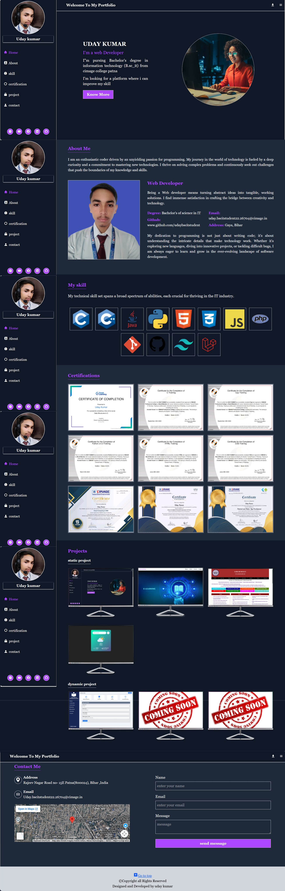

# 🌐 Personal Portfolio Website

## 📌 Overview

This is my personal portfolio website created to showcase my skills, projects, and background as a BSc IT student. It represents my journey in web development and highlights the work I have done so far.

---

## 🚀 Features

* Responsive and user-friendly design
* Clean and modern UI
* Sections for Home , About Me, Skills, Certification ,  Projects and Contact.
* Easy navigation for better user experience

---

## 🛠️ Technologies Used

* HTML
* Tailwind CSS
* JavaScript

---

## 📂 Sections Included

* Home
* About Me
* Skills
* Certification
* Projects
* Contact

---

## 🎯 Purpose

The main purpose of this portfolio is to present my technical skills and projects to recruiters and demonstrate my ability to build real-world web applications.

---

## 🔗 Live Demo

👉 https://udaybscitstudent.github.io/myinfo/

---

## 📸 Preview

(Add screenshots of your portfolio here for better presentation)

---

## 📬 Contact

If you would like to connect with me, feel free to reach out.

---
